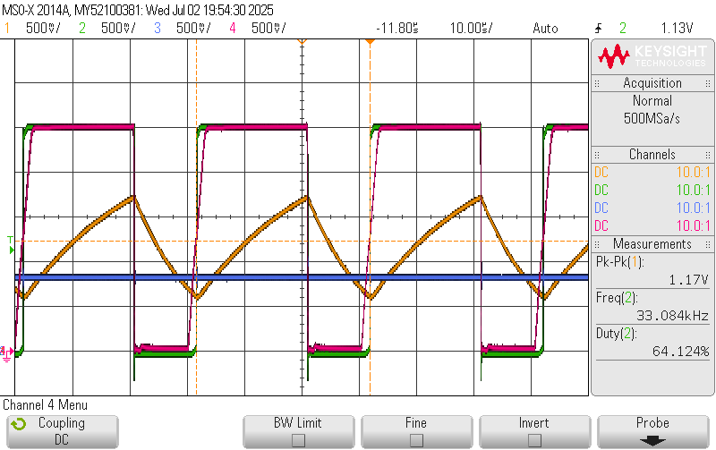

# Building a '555' with MOSbius

The '555' is an iconic chip that is often used in entry-level electronic experiments. The MOSbius chip has the necessary devices to create the 555 functionality. It offers an opportunity not only to build 555 projects, but dig into the internal operation of the 555 chip. 

The original 555 was a bipolar design. 

| Cap [nF] | $f_{calc}$ [kHz] | $f_{meas}$ [kHz] | Error [%] |
| --- | --- | --- | --- |
| 57.9 | 0.821 | 0.807 | | 
| 22   | 2.160 | 2.12 | |
| 10.3 | 4.614 | 4.32 | | 
| 5.66 | 8.397 | 7.58 | | 
| 0.976 | 48.69 | 32.7 | | 
| 0 | | 241 | | 

## C = 22nF

When the capacitor voltage (CH1, yellow) reaches the 1/3 VDD reference (CH3, blue), bus05 (CH4, red) and the output waveform (CH2, green) switch instantenously. The 555 circuit does not add significant delay and the oscillation frequency is very close to the frequency predicted by the values of the R-C network.

## C = 1nF

The capacitor voltage (CH1, yellow) goes below the 1/3 VDD reference (CH3, blue) because bus05's rise time is relatively large compared to the period, adding delay, which delays the switching of the output and discharge; hence, the undershoot on the capacitor voltage (CH1, yellow). The delay added by the 555 circuit reduces the oscillation frequency 
