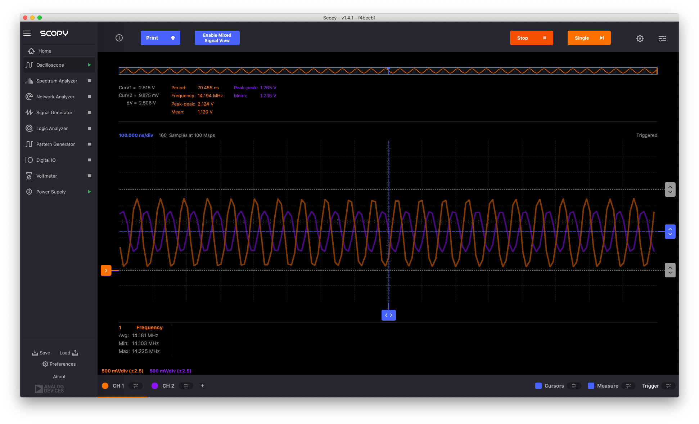
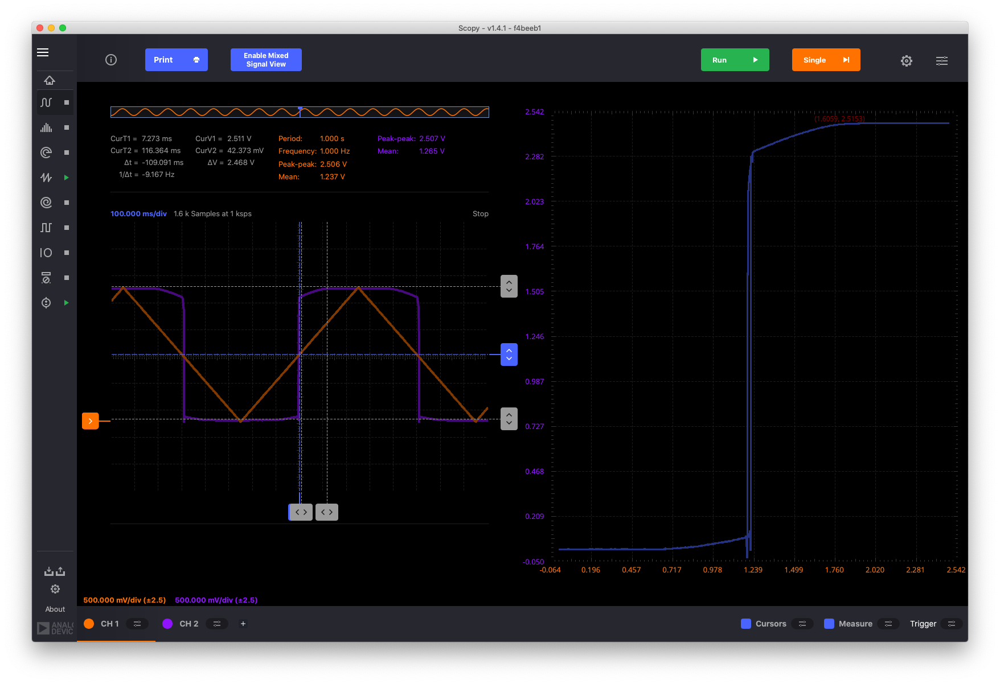
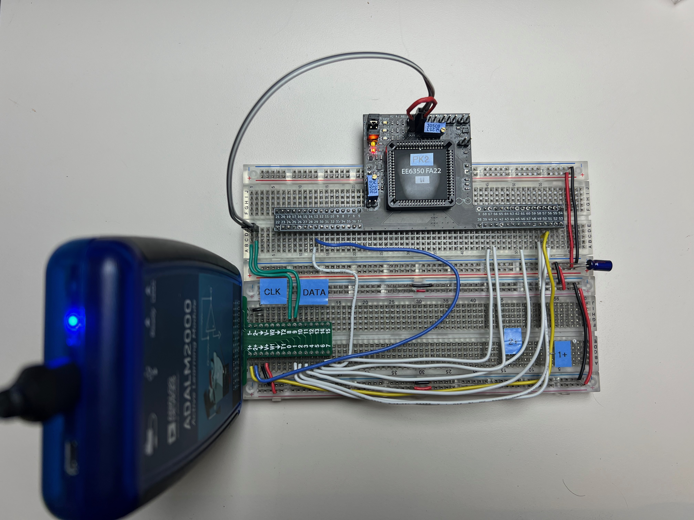

# Ring Oscillators
## Manual Connections
We start with an experiment with *manual* connections. The inverter stages and transistor are connected with wires on the breadboard. The on-chip switch matrix is left *disabled* (keep `EM_PU` open). 

### Three-Stage Ring Oscillator (1-16-16)

```{figure} img/3stage_RO_1x_schematic_c.png
Three stage 1-16-16 ring oscillator built using manual wiring; the VDD and VSS connections in black are made on the MOSbius chip; the colored VDD and VSS connections have to be made manually along with the stage connections (see picture below)
```

```{figure} img/3stage_RO_manual_setup.jpeg
MOSbius chip wired with external connections to build a 3-stage 1-16-16 ring oscillator; each node is using a different color wire corresponding to the schematic; in the lower left corner is the ADALM 2000 that provides power and oscilloscope measurements.
```


**Circuit Topology**
- we use the two 16x inverter pairs for *stages 2* and *3*, and a 1x nMOS and a 1x pMOS as *stage 1*
- we make the following connections on the breadboard:
    - `stage1_in` 52 & 53 & 40 & 12; 
    - `stage2_in` 51 & 50 & 48; 
    - `stage3_in` 49 & 39 & 13; 
    - 14 & VDD; 38 & VSS; 
- make sure to leave the `EN` signal low, i.e. keep `EM_PU` jumper open
- on the ADALM we connect 
    - `V+` to the positive rail on the breadboard and 
    - `GND` to the negative rail on the breadboard; 
    - `1-` and `2-` to `GND`
    - `1+` and `2+` are used to make measurements
- we power the chip with **2.5V** and observe oscillation!!
#### Measurements
We place the `1+` oscilloscope on different nodes:
- `1+` on `stage3_in` --> 14.6MHz
- `1+` on `stage2_in` --> 13.2MHz
- `1+` on `stage1_in` --> 14.4MHz 
- Notes: 
    - I would have expected the frequency to decrease in this experiment; load on stage 2 is the lowest (1x), so the scope adds the least load; load on stage 1 is high (16x) but drive strength is high (16x); load on stage 3 is high (16x) and drive strength is low (1x); yet the frequency of the 3rd experiment is higher than the 2nd; note that the amplitude in the 3rd experiment is lower also. 
    - The ADALM is sampling at its fastest speed (100Msps) and the measurements are a bit 'jittery' (I have not found (yet?) how to average measurements in Scopy). 


## Connections Using the On-Chip Switch Matrix

### Three-Stage Ring Oscillator (16-16-8)

We build the 3-stage 16-16-8 ring-oscillator circuit shown in the following [LTspice schematic](sim/3stage_RO_16_16_8.zip). It uses the two 16x inverter stages and creates an 8x inverter stage by combining the pairs of 4x nMOS and pMOS transistors; we use `BUS9` for VSS and `BUS10` for VDD.
```{figure} ./img/3stage_RO_8x.png
LTspice schematic for the 16-16-8 ring oscillator
```

The programming is described in detail in the [Programming the Chip Using the MOSbiusTools chapter](../4_sw_support/MOSbiusTools.md). In brief, first we translate the schematic `cir` file to a connections json file or manually create a [connections json file](./img/connections_3stage_RO_8x_vdd_10_vss_9.json) that we then translate into a [bitstream](img/3stage_RO_8x_vdd_10_vss_9.txt) and [clock file](img/3stage_RO_8x_vdd_10_vss_9_clk.txt). We upload the bitstream into the MOSbius chip using the `Pattern Generator` function of the ADALM using channel 8 for the *CLK* and channel 9 for the *DATA*; we typically use *200kHz* for the frequency for *CLK* and *100kHz* for the frequency for *DATA*; during programming the `EN` needs to be LOW; we leave it floating so the internal pull-down will hold it LOW; and we also disconnect the `1+` and `2+` scope inputs. 


We then enable the connection matrix by asserting the `EN` signal. Notice that the red LED shows that the chip is powered and the orange LED shows the switch matrix is enabled.


We now measure the outputs of the various stages; `1-` and `2-` are connected to the VSS at the ADALM connector; `1+` is displayed in orange and `2+` is displayed in purple on the ADALM scope screen. 

The output of stage1 (16x) (orange) and stage2 (16x) (purple) are almost rail to rail. The oscillator operates at 14.2MHz. 

The output of stage3 (8x) (purple) has a smaller amplitude which is expected given its lower drive strength. 

The frequency of operation is a bit high to make very clean measurements on a solderless breadboard. E.g., here we observe pin43, which is the source of the 8x nMOS transistors and should be VSS, and pin9, which is the VDD of the 8x pMOS transistors and should be VDD; but we clearly see the effect of packaging (bondwire inductances) and board parasitics (lack of a good ground plane). Note that the frequency of operation is now higher, 18.4MHz, since there is no loading on the stages by the oscilloscope. 

### Three-Stage Ring Oscillator - Studying the Loop

Next, we open the loop by splitting BUS03 and disconnecting the third stage output from the first stage input ([connections](./img/connections_3stage_RO_8x_vdd_10_vss_9_open_loop.json), [bitstream](./img/3stage_RO_open_loop.txt), [clk](./img/3stage_RO_open_loop_clk.txt)).

#### DC Transfer Characteristic
We now measure the DC transfer characteristics by applying a slow rail-to-rail triangle wave to the first stage input (BUS03) and measure the voltage at its output (BUS04), shown on the right; using the X-Y display function of the oscilloscope, we get the typical inverter transfer characteristic. 


Measuring the output of stage 2 we obtain a non-inverting amplifier with more gain. 


At the output of stage 3 we get an inverting amplifier with more gain. 


#### Delay Measurement vs Oscillation Frequency
Next, we load each of the stages with an external capacitive load of 4.7nF to VSS. Then, using a fast square-wave input we measure a delay between the input of the first stage and the output of the third stage of 1.08us, predicting a ring oscillator frequency of 462.9kHz. 


We can then close the ring oscillator loop with an external connection and observe the oscillation frequency of 436.7kHz, which is about 7% less than predicted based on the delay measurement. 


One can now experiment with different loading capacitors and study the relationship between the load and the frequency. Note that when using large load capacitors, we noticed that the oscillator configuration with an internal connection between the output of stage 3 and the input of stage 1, did not behave as expected. However, when closing the loop externally on the breadboard, the operation was as expected. This is likely due to the different effect of various parasitics like bondwires, PCB wires, etc. which get 'bypassed' when using on-chip connections. 

### Seven-Stage Ring Oscillator

The schematic for the 7-stage ring oscillator is shown in the following figure. It uses a large number of the transistors available. The associated [bitstream](./img/7stage_RO_bitstream.txt) and [clock file](./img/7stage_RO_bitstream_clk.txt) are generated and loaded into the chip as described above. Note that due to the presence of the jumper BUS08 is renamed to BUS01 in the netlist. 


The output of stage 7 (BUS01) and stage 6 (BUS07) is connected to the ADALM oscilloscope `1+` (yellow wire/orange trace) and `2+` (blue wire/purple trace), respectively, and the inputs of stage 1 through 7 are connected to `DIO1` through `DIO7` on the ADALM. 


The following mixed-mode measurements are obtained. The frequency is 2.14MHz. It is instructive to review the delays from stage to stage and correlate it with the sizing and loading of each stage. Note that the logic signals are captured with a 100Msps logic analyzer (i.e. with a 10ns resolution). The measurement is triggered by the oscilloscope waveform on `1+`. 


When adding 4.7nF capacitors to VSS on all the outputs, the frequency goes down to 105.6kHz 


