# Lab 1: Solution

```{note}
Your results might differ slightly from the results presented here depending on the specific components used in your setup. 
```

## DC Transfer Characteristic of a Resistive Divider Using a Signal Generator and the X-Y Plot of the Oscilloscope

- Test Setup 

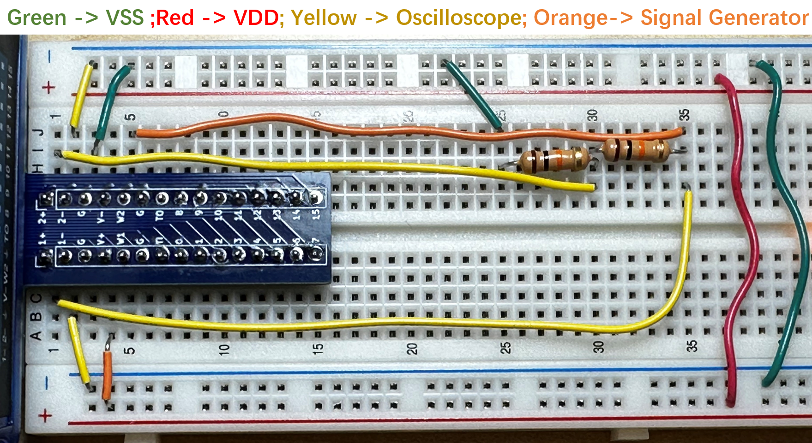

- Generator Setup

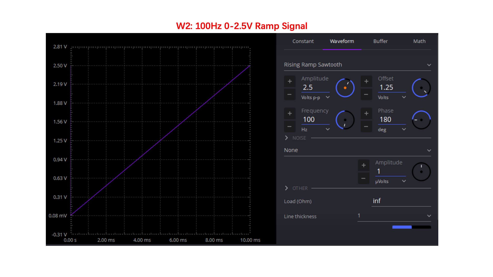

- Results 

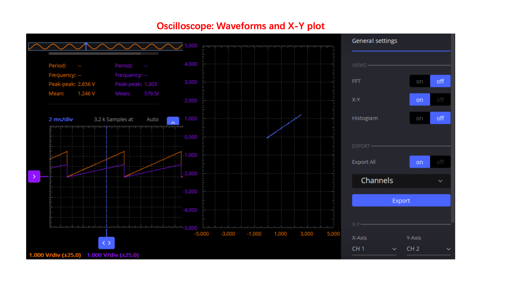
As shown in the figure, $V_{2+}=\frac{V_{1+}}{2}$ so the gain of this circuit is 0.5. 

## I-V Transfer Characteristic of an LED Diode Using a Signal Generator and the X-Y Plot of the Oscilloscope

- Test Setup with Yellow LED

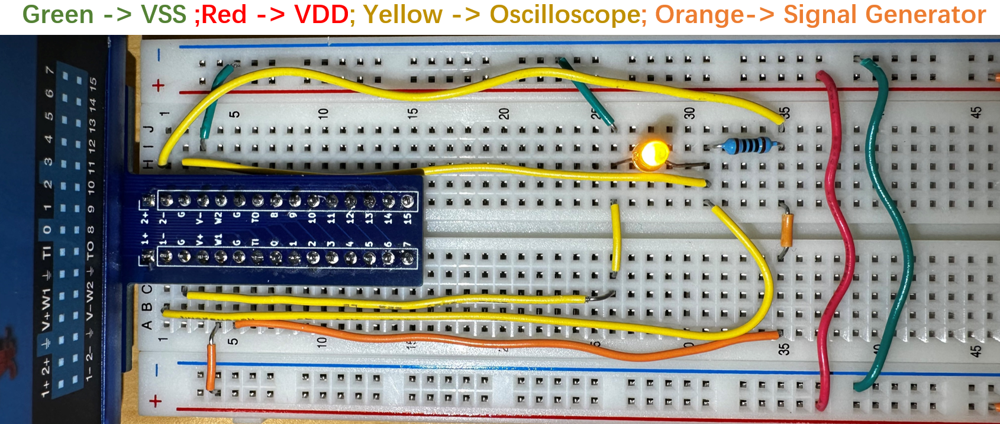

- Waveforms for the measurement of a red LED

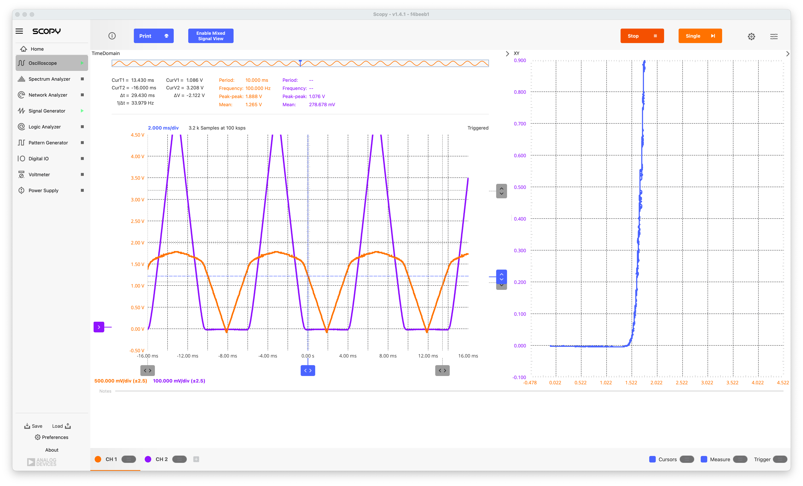

- Waveforms for the measurement of a blue LED

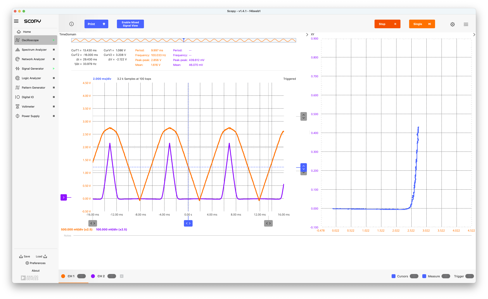

- I-V Characteristics for different color LEDs
    - Measurements were taken for different color LEDs and saved as `.csv` files and plotted
    - The different *turn-on* voltages for the different color LEDs can be observed
    - Using a log scale for the current and a linear scale for the voltage, a straight line is expected beyond the turn-on point; this is only partially observed [^extend]. 
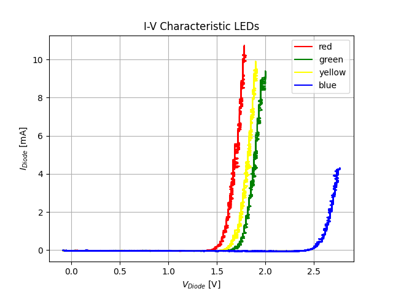
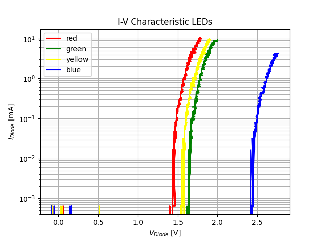

## Frequency Response of RC Circuits using the Network Analyzer

- Schematics


- Measured Frequency response of the R-C networks (A & C)
    - The frequency responses were measured using the *Network Analyzer* function of the ADALM2000 to generate a *Bode plot*.

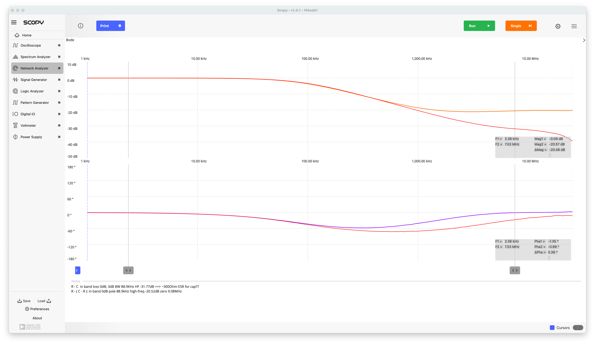

- Discussion Frequency response of the R-C networks (A & C)
    - Network A is a first-order low-pass filter with a pole at 106kHz in the LHP. 
        - We expect a DC gain of 0dB and beyond 106kHz the gain should drop by 20dB/decade. The phase shift should start at 0 degrees and go to -90 degrees. 
        - This behavior is largely observed in the measurements (red traces), except that at frequencies beyond 1MHz the phase shift start to reduce again towards 0 degrees. This is likely due to a parasitic series resistance in the capacitor (see also discussion network C)
    - Network C is a first-order low-pass filter with a pole at 96.5kHz and a zero at 1.06MHz both in the RHP
        - We expect a DC gain of 0dB up about 96.5KHz where the gain should dropping by 20dB/decade, until we reach about 1.06MHz, where the gain should become -20dB; the phase should start at zero, go towards -90 degrees and then return to 0 degrees.
        - This behavior is observed in the measurements (orange and purple traces) within the expected variations due to the tolerances of the passive components. 

- Measured Frequency response of the C-R networks (B & D)

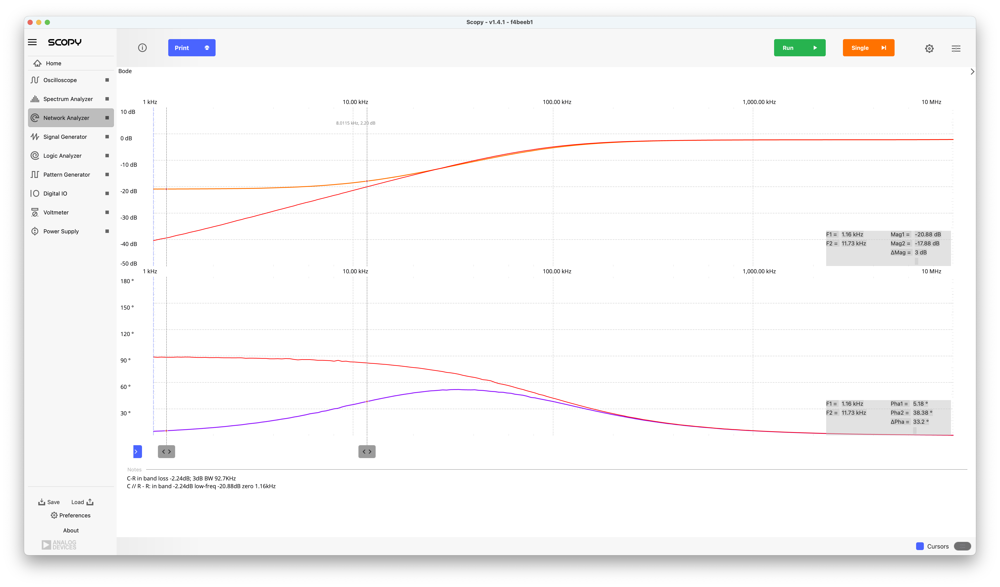

- Discussion Frequency response of the C-R networks (B & D)
    - Network B is a first-order high-pass filter with a pole at 106kHz in the LHP. 
        - We expect a DC gain of 0, increasing with 20dB/decade until 106kHz where the gain should level off to 0dB. The phase shift should start at 90 degrees and decrease to 0 degrees. 
        - This behavior is largely observed in the measurements (red traces), except that the in-band gain is -2.2dB instead of 0dB at high frequencies. This is likely due to a parasitic resistance in the capacitor (see also discussion network A)
    - Network D is a first-order high-pass filter with a pole at 116.7KHz and a zero at 10.6KHz both in the RHP.
        - We expect a DC gain of -20dB up about 10.6KHz where the gain should increase by 20dB/dec, until we reach about 116.7KHz, where the gain should become 0dB; the phase should start at zero, increase towards 90 degrees and then decrease back to 0 degrees.
        - This behavior is observed in the measurements (orange and purple traces) except that the HF in-band gain is again lower than 0dB as for network B. 

## Step Response of RC Circuits using a Signal Generator and Oscilloscope

- Measured Step Response of the R-C networks (A & C)

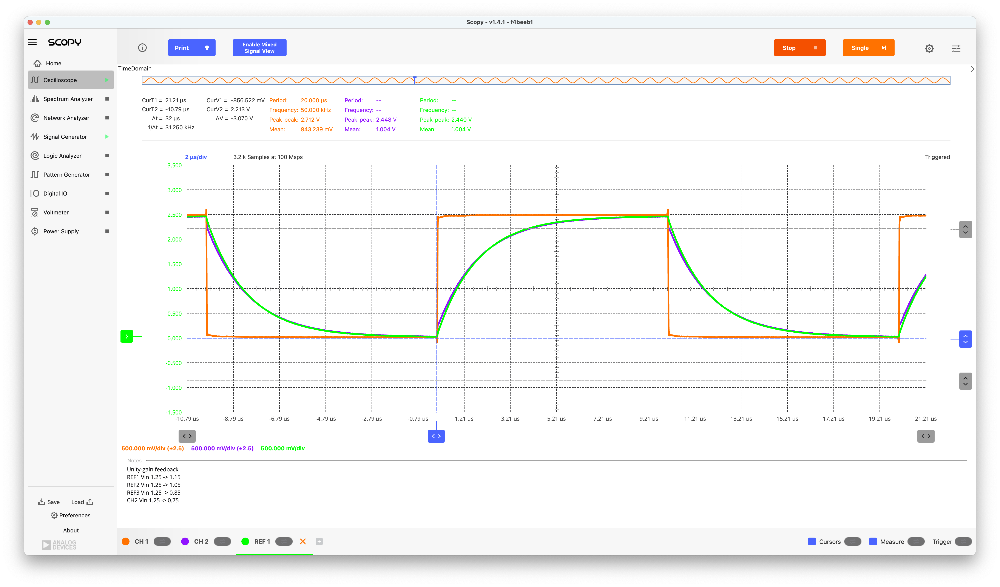
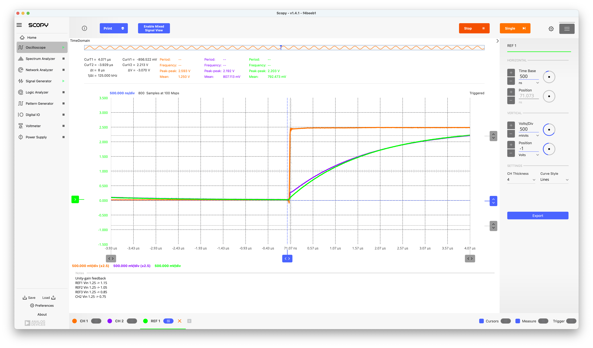

- Discussion Step Response of the R-C networks (A & C)
    - For network A we expect a step response of the form $V_{step}(1-\exp(-t/\tau)$, with $\tau$ the time constant corresponding to the pole frequency, a.k.a. first-order exponential settling, which we indeed observe (green curve). 
    - For network C we expect an initial step of $0.1 V_{step}$ followed by a first-order exponential settling. Careful observation of the measurements (blue curve) confirms this. 

- Measured Step Response of the C-R networks (B & D)

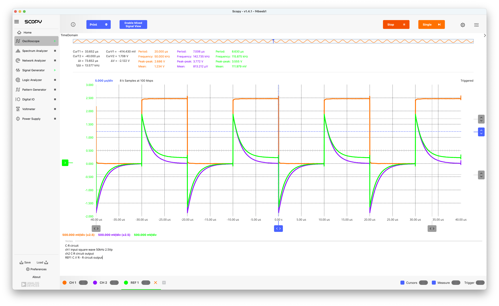

 - Discussion Step Response of the C-R networks (B & D)
    - For network B we expect a step response of the form $V_{step}\exp(-t/\tau)$, which we indeed observe (blue curve). 
    - For network D we expect a similar exponential settling, however to a DC value of $0.1 V_{step}$, confirmed in the measurements (green curve). 

[^extend]: The measurements might have to be extended for larger drive voltages and thus larger currents, but you have to be careful that your signal generator can provide such currents. 


