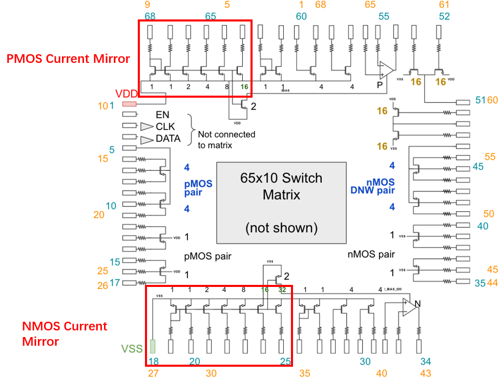
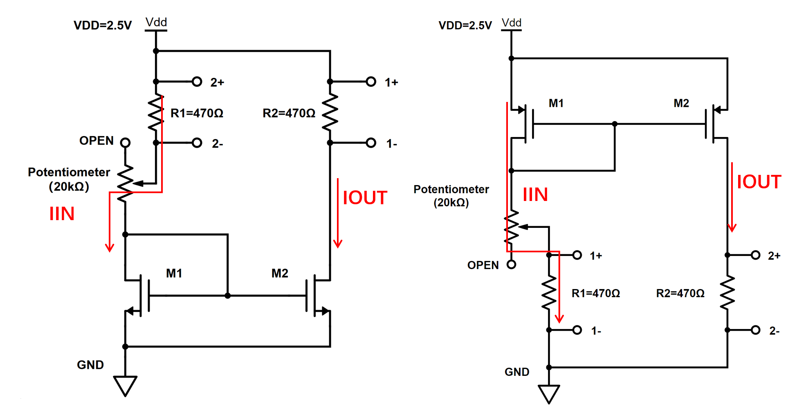
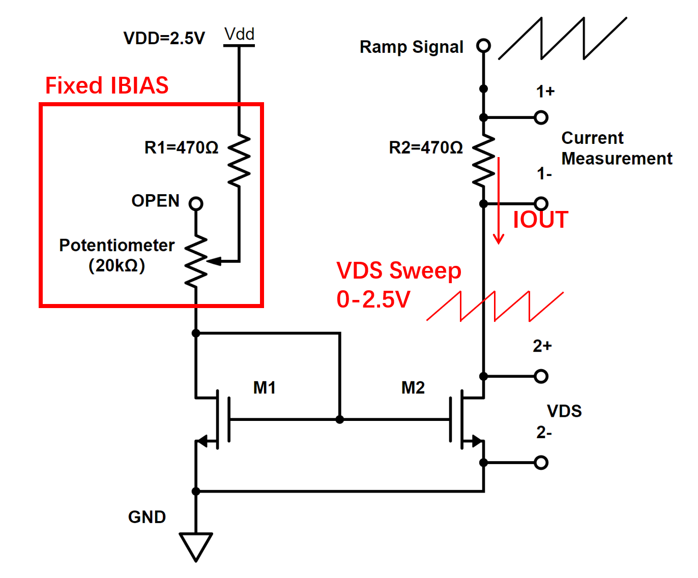
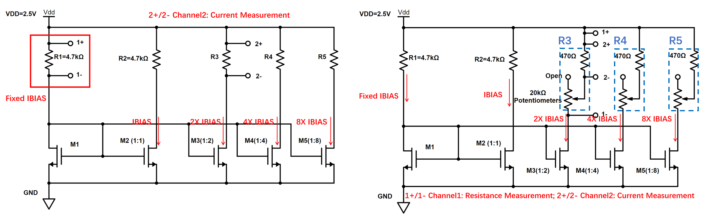

# Lab 2: Current Mirrors
  
 The MOSbius chip provides you with nMOS and pMOS current mirrors. This lab will help you get a sense of transistor characteristics and the principles of current mirrors. 


## Objective

* Explore the operation of MOS transistors in current mirror applications
* Understand the effect of transistor sizing
* Understand the effect of drain-source voltage on mirror accuracy

## Preparation

* Review your course notes on current mirrors and single transistor characteristics 
* Review the pin map for the chip and find where the current mirrors are


## Materials
* ADALM2000 Active Learning Module
* Breadboard & Wires
* Resistor: 1K$\Omega$, 470$\Omega$, 
* Potentiometer: 20K$\Omega$ (or similar value)
* MOSbius Chip & PCB

## Experiments

```{attention}
To use the MOSbius chip, you ALWAYS need to apply a supply between VDD and GND to properly bias the ESD protection circuits.
```
```{attention}
Before doing your measurements, make sure the oscilloscope is correctly calibrated. One way to check is to short 1+ & 1- and 2+ & 2- and check if you get a reading of 0V. The ADALM2000 has a +/-2.5V and +/-25V input range, yielding different accuracies. For the measurements here, try to make sure you are in the +/-2.5V by adjusting the vertical scale of your scope channels. If there is a remaining offset you can consider correcting your measurements manually. 

The tolerance of the resistor value also determines the accuracy of the current measurement. Typical resistor tolerances can vary from 10% to 5% to 1% or less, depending on the type of resistor you are using. Consider using a high-precision multimeter to measure your resistor values.
```

1. **IOUT vs IIN for the 1:1 Current Mirror:**
    - Set up the circuit shown below on your breadboard with the following parameters:
        - M1 and M2 are the transistors on the MOSbius chip of the current mirror under test  
        - use a VDD of 2.5V
        - R1 = R2 = 470$\Omega$ for the 1:1 current mirror 
        - Attach the differential scope channels 1+/1- and 2+/2- as shown

    
    - Measure the IOUT of the 1:1 current mirror while sweeping IIN. Turn the potentiometer to change IIN. Monitor the current IIN and IOUT by observing the voltages across R1 and R2. Use the "Measure" feature in your ADALM2000 Oscilloscope so you can read the "Mean" measurement for both channels. Collect about 10 points. Plot IOUT vs IIN. 

    - Data Analysis Questions: 
        - Q: Is IOUT the same as IIN? If not, what are possible physical sources for the errors? 
    
    - Optional: Increase the resistance at the output used for the current measurement to 4.7K$\Omega$. 
        - Q: Are there any changes in the error between IIN and IOUT? Can you explain? 

1. **IOUT vs VDS for the 1:1 Current Mirror:** 
    - Change the setup as shown below: 
        - Generate a ramp to slowly sweep the VDS from 0V to 2.5V using the signal generator in the ADALM2000. 
        - Connect 2- to the ground and 2+ to the drain node of load transistor Q2 to measure VDS. 
        - Connect 1+  and 1- across the load resistor R2 to measure the current. 

    

    - Measure the 1:1 nMOS current mirror IOUT while sweeping VDS with a fixed IBIAS of around 200uA. Plot the IOUT-VDS curve.

    - Data Analysis Questions:
        - Q1: Identify the operating regions of the transistor (i.e. linear or saturation region).
        - Q2: When is IOUT equal to IBIAS? Explain.
        - Q3: Estimate the DC output impedance of M2.
        - Q4: Determine the output voltage range of this 1:1 current mirror when used as a current source.

    - (Optional) Change IBIAS to 800uA (X4) and repeat the measurement and analysis

    - (Optional) Repeat for the pMOS 1:1 current mirror but make the appropriate adjustments to the setup. 

3. **The 1:2, 1:4, 1:8 Current Mirrors**


- Measurement
    - Fix the bias resistance for the IREF to 4.7K$\Omega$s and measure the IREF. 
    - Find the proper load resistors R3, R4, and R5 that give output currents with the correct ratios 1:2, 1:4, and 1:8. 
        - One way is to use a variable resistor to obtain the appropriate load value. 
        - Alternatively, you can calculate the appropriate load resistance value and use a resistor with this value as the load. Verify the output current. 
    
    -  Each student in the group can be responsible for a different ratio. 

- Analysis:
    - Q1: Based on your observations in previous measurements, how do you explain the values for R3, R4, and R5 that set the output current to correct ratio. 

- Optional:
    - Estimate the DC output impedance of each ratio through and IOUT-VDS measurement.
   


 